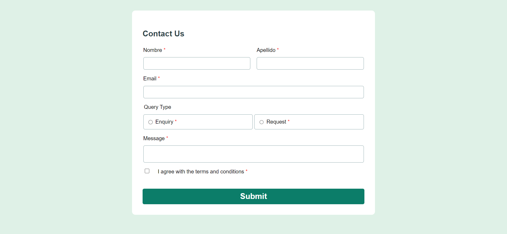

# Frontend Mentor - Contact form solution

This is a solution to the [Contact form challenge on Frontend Mentor](https://www.frontendmentor.io/challenges/contact-form--G-hYlqKJj). Frontend Mentor challenges help you improve your coding skills by building realistic projects. 

## Table of contents

- [Overview](#overview)
  - [The challenge](#the-challenge)
  - [Screenshot](#screenshot)
  - [Links](#links)
- [My process](#my-process)
  - [Built with](#built-with)
  - [What I learned](#what-i-learned)
  - [Continued development](#continued-development)
  - [Useful resources](#useful-resources)
- [Author](#author)
- [Acknowledgments](#acknowledgments)

**Note: Delete this note and update the table of contents based on what sections you keep.**

## Overview

### The challenge

Users should be able to:

- Complete the form and see a success toast message upon successful submission
- Receive form validation messages if:
  - A required field has been missed
  - The email address is not formatted correctly
- Complete the form only using their keyboard
- Have inputs, error messages, and the success message announced on their screen reader
- View the optimal layout for the interface depending on their device's screen size
- See hover and focus states for all interactive elements on the page

### Screenshot




### Links

- Solution URL: [Add solution URL here](https://gleeful-syrniki-b2ebbe.netlify.app/)

## My process

1: start with only a field, this field must have a state for control the value and the error
2: control two fields at the same time, this field must have separated error state and value i have to refactorized in a custom hook for better reusability
3: add the others fields and customize the useField hook using the open/close principle
4: manage the form state and the validators of each field
5: add styles using custom css and selectors for reduce the css to the minimum
6: style the errors message
7: typing the components props

### Built with

- Semantic HTML5 markup
- CSS custom properties
- Flexbox
- CSS Grid
- [React](https://reactjs.org/) - JS library

### What I learned

How to use a custom prop for manage a multiple states of a input, manage the errors of a form in a separated way and how to control many states of one component


```css
  fieldset.error input[type="text"] {
  border: 1px solid red;
  padding: 10px;
}
```
this validate function took a array of erros, each errors have own message and validate rule, the function iterate over the errors and validate, then return the first error message that find

this validate function are very flexible, allow validate multiple rules everyone with own error message, also use the generics typescript for more flexibility.
Im very proud of it
```ts

const validateFn = <T>(value: T, errors: FieldError<typeof value>[]): string | null => {
    const validateResult = errors
        .map(error => error.validate(value) ? null : error.message)
    return validateResult.find(res => res) ?? null
}

const validate = (v: T) => {
        const isValid = validateFn(v, errors) === null 
        const errorMessage = validateFn(v, errors)
        if (!isValid) {
            setError(errorMessage)
            setValue(initialValue)
        } else {
            setError(null)
        }
    }
```
### Continued development

I want to use a design pattern to better the usage of useField hook

## Author
- Frontend Mentor - [@yourusername](https://www.frontendmentor.io/profile/Aborja-dev)